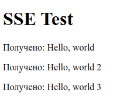

# CubeCastRouter

## Описание

**CubeCastRouter** — это сервер на **Rust**, предназначенный для синхронизации и управления 3D-сценами с кубиками между пользователями. Он поддерживает несколько типов соединений и маршрутизацию сообщений между клиентами и более глубокими бэкендами.

## Возможности

1. **Поддержка различных каналов связи**:

   - WebSocket
   - Server-Sent Events (SSE)
   - Long Polling (резервный вариант)

2. **Группировка пользователей**:

   - Объединение пользователей в группы
   - Широковещательная рассылка сообщений внутри группы

3. **Маршрутизация запросов**:

   - Ведущий пользователь отправляет запрос
   - Бэкенд пересылает его на другой (более глубокий) бэкенд
   - Ответ рассылается всем пользователям в группе

4. **Хранение состояния**:

   - Накопление ответов от бэкенда
   - Учет всех изменений 3D-сцены

5. **Доступ к состоянию по запросу**:

   - Клиенты могут получать актуальное состояние сцены

6. **Очистка состояния**:

   - Возможность сброса всех данных сцены по запросу

7. **Структура передаваемых данных**:

   - Тип 3D-объекта (кубик)
   - Координаты на сцене
   - Признак выделения объекта

8. **Контроль доступа**:

   - Разные права на редактирование сцены у разных пользователей

## Установка и запуск

```sh
# Клонируем репозиторий
git clone https://github.com/your-repo/cube-cast.git
cd cube-cast

# Собираем и запускаем
cargo run --release
```

## API (Примеры запросов)

### Подключение по WebSocket

```javascript
const ws = new WebSocket("ws://localhost:7070/ws");
ws.onmessage = (event) => console.log("Новое сообщение:", event.data);
```

### Подписка через SSE

```javascript
const eventSource = new EventSource("http://localhost:7070/sse");
eventSource.onmessage = (event) => console.log("Новое сообщение:", event.data);
```

### Запрос через Long Polling

```javascript
async function poll() {
    const response = await fetch("http://localhost:7070/long-polling");
    const data = await response.json();
    console.log("Новое сообщение:", data);
    setTimeout(poll, 2000);
}
poll();
```

### Тестирование

- Подключите несколько WS-клиентов

```bash
wscat -c ws://127.0.0.1:7070/ws
```

- Подключите в отдельном терминале Long Polling клиента.

```bash
curl http://127.0.0.1:7070/long-polling
```

Он будет ждать сообщение. Если сообщение пришло, запрос завершится с полученным сообщением.

- Подключите SSE клиента (откройте в браузере ./tests/test-SSE-page.html)



- Чтобы разослать сообщение всем клиентам отправляйте его через WS, либо используйте POST запрос к /send

```bash
curl -X POST -H "Content-Type: application/json" -d "\"Hello, world\"" http://127.0.0.1:7070/send
```

